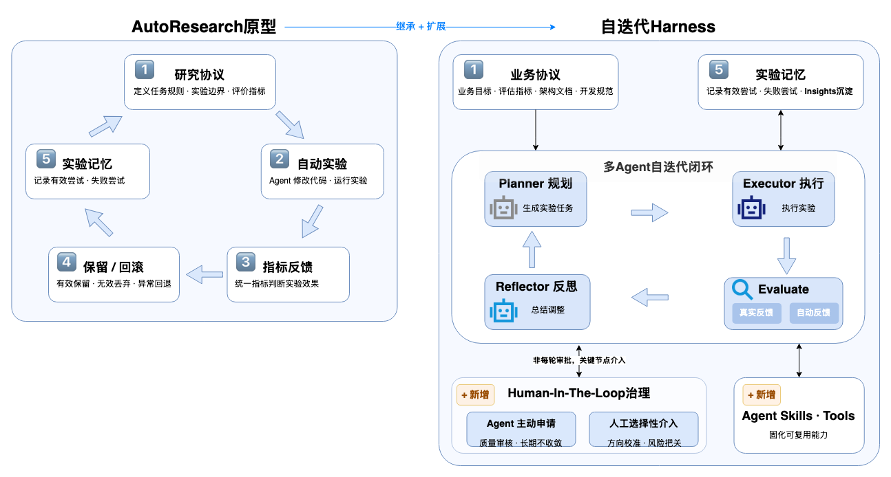

# `algorithm-evoloop`

`algorithm-evoloop` 是基于可配置大模型接口的轻量多智能体自迭代框架，适用于实验链路较长的复杂算法与工程任务。

框架只固定自迭代机制和角色交接协议，不提供具体业务算法：

- 规划者、执行者、评估者和反思者自动交接。
- 编排引擎负责结构校验、人工介入、长期记忆和版本治理。
- 用户提供任务上下文、实验工具、评估规则、分析技能、指标和业务流程。

仓库根目录就是 Claude Code 工作区，也是资源的唯一来源：

```text
CLAUDE.md
.claude/skills/code-review-skill/SKILL.md
prompts/
examples/simple_case/task.json
assets/algorithm_evoloop_framework.png
algorithm_evoloop/  # 只包含 Python 代码
```

## 最小闭环

```text
长期记忆
  ↓
规划者（Planner）
  ↓ plan.json
执行者（Executor）── 实验工具 → 原始指标 / 日志 / 产物
  ↓ execution.json
评估者（Evaluator）── 评估工具 / 分析技能 → 评估结论
  ↓ evaluation.json
反思者（Reflector）── 治理建议 / 记忆更新
  ↓ reflection.json
人工审查（按需）
  ↓
编排引擎（Engine）── Git 保留 / 回退 / 分支 / 阻塞
  ↓
下一轮规划者
```



## 四个角色的边界

| 角色 | 负责 | 不负责 |
|---|---|---|
| 规划者（Planner） | 读取任务、当前最优版本和长期记忆，提出一轮计划 | 执行实验、评价结果 |
| 执行者（Executor） | 修改候选、调用实验工具、运行实验、收集原始指标、日志和产物 | 判断指标是否改善、证据是否完整、候选是否保留 |
| 评估者（Evaluator） | 调用评估工具和分析技能，检查证据，比较指标，输出评估结论 | 修改候选、执行版本操作 |
| 反思者（Reflector） | 使用评估结论提出治理建议，沉淀经验和失败路线 | 重新运行实验、重新计算指标 |
| 编排引擎（Engine） | 串联角色、校验结构和文件引用、处理人工决定、更新版本和记录 | 重算评估结论、改写反思建议、承载业务规则 |

执行者产生的是实验事实，评估者产生的是判断。例如：

```text
Executor: raw_metrics.score = 0.61，artifacts = []
Evaluator: 缺少必要证据，verdict = insufficient_evidence
```

编排引擎不会根据 `0.61` 重新计算或覆盖 Evaluator 的结论。

## 快速开始：跑通三轮闭环

运行要求：

- Python 3.10 或更高版本
- Git
- 一个兼容对话补全协议的大模型接口

接口地址、模型和密钥可以用配置文件、环境变量或命令行参数提供，优先级为命令行参数 > 环境变量 > 配置文件：

```sh
export LLM_BASE_URL=https://your-endpoint/v1
export LLM_MODEL=your-model
export LLM_API_KEY=your-key
```

也可以把同样的字段写进配置文件，用 `--llm-config` 或 `LLM_CONFIG` 指定：

```json
{
  "base_url": "https://your-endpoint/v1", "model": "your-model",
  "api_key_env": "YOUR_KEY_ENV", "chat_path": "/chat/completions",
  "timeout_seconds": 180, "temperature": 0.0, "max_retries": 2,
  "structured_output": "json_schema", "extra_headers": {}, "extra_body": {}
}
```

`api_key_env` 只保存密钥所在的环境变量名，密钥本身不写入配置文件，运行日志中也只记录 `***`。`structured_output` 支持 `json_schema`、`json_object` 和 `text`，接口不支持时会自动按这个顺序降级。

以下命令必须从 clone 后的仓库根目录执行。可以先用一次真实调用验证接口是否可用，再用预设人工决定跑通自动演示，第二轮不会停顿：

```sh
python -m algorithm_evoloop.cli llm-smoke
python -m algorithm_evoloop.cli run \
  --workspace /tmp/algorithm-evoloop-demo \
  --human-decision rollback
```

该命令默认读取 `examples/simple_case/task.json`，由大模型接口自动完成 Planner → Executor → Evaluator → Reflector 的三轮交接。第二轮会因缺少必要产物触发人工审查；`--human-decision rollback` 用于在非交互环境中预设“回退”决定。

人工审查模式不传预设决定：

```sh
python -m algorithm_evoloop.cli run --workspace /tmp/algorithm-evoloop-demo
```

在交互式终端中，第二轮会等待输入 `keep / rollback / branch / block`。如果标准输入不是交互式终端，流程会返回 `blocked` 并提示增加 `--human-decision`，不会静默回退。

运行时会打印每个角色的输入和输出 JSON，因此终端内容会比较长。阅读时不需要逐行理解所有字段，重点看每一轮中 `memory_used`、`raw_metrics`、`verdict`、`human_review`、`proposed_action` 和 `memory_updates` 如何串起来。示例输出说明见 [`assets/three_round_run_output.md`](assets/three_round_run_output.md)。

预期最终输出：

```text
Final champion: 0.78
Status: target_reached
```

其中 `Final champion` 表示最终最优得分，`target_reached` 表示达到目标。运行记录写入 `--workspace` 指定的目录，例如：

```text
/tmp/algorithm-evoloop-demo/runs/<run_id>/
```

## 三轮发生了什么

`score` 只是演示用的原始指标。示例的重点不是优化分数，而是展示完整交接和治理链路。

| 轮次 | Planner 计划 | Executor 原始结果 | Evaluator 结论 | Reflector / 治理结果 |
|---|---|---|---|---|
| 1 | 基于初始目标提出一个小而可验证的改动，不使用历史记忆 | `score=0.62`，必要产物齐全 | 改善（`improved`） | Reflector 建议保留，Engine 执行 `keep` |
| 2 | 基于当前最优版本继续尝试改进 | `score=0.61`，缺少 `artifacts/evidence.json` | 证据不足（`insufficient_evidence`），请求人工审查 | 人工决定 `rollback`，Reflector 写入失败记录和 `do-not-repeat` |
| 3 | 读取第二轮失败记录、禁止重复项和人工决定，计划补齐证据 | `score=0.78`，必要产物齐全 | 改善（`improved`） | Reflector 建议保留，Engine 执行 `keep`，达到目标 |

第二轮产生的长期记忆会带有稳定标识。第三轮 Planner 在 `memory_used` 中引用这些标识，并明确要求补齐证据。终端输出中的主要字段含义和三轮关键 JSON 节选见 [`assets/three_round_run_output.md`](assets/three_round_run_output.md)。

## 任务协议

示例任务只有一个配置文件：

```text
examples/simple_case/task.json
```

与扩展能力相关的核心字段：

```json
{
  "objective": "将通用候选方案的得分从 0.40 提升到 0.75 以上。",
  "metric": {
    "name": "score",
    "direction": "maximize",
    "initial": 0.4,
    "target": 0.75
  },
  "executor_tools": [
    {
      "name": "mock_experiment_runner",
      "mode": "mock"
    }
  ],
  "evaluator_tools": [
    {
      "name": "mock_result_analyzer",
      "mode": "mock"
    }
  ],
  "evaluator_skills": [
    {
      "name": "code-review-skill",
      "mode": "prompt",
      "description": "加载项目自有技能并记录代码审核结果。"
    }
  ],
  "evaluation_rules": [
    "必要证据齐全且代码审核通过后才能给出 improved。"
  ],
  "required_evidence": [
    "metrics.json",
    "logs.txt",
    "artifacts/evidence.json"
  ]
}
```

这些字段只是声明式扩展点：框架把它们传给对应角色，并记录调用结果，不提供插件注册、动态安装或依赖管理。

## 每轮记录如何互相追溯

| 记录 | 关键内容 | 与下一步的关系 |
|---|---|---|
| `plan.json` | `memory_used` | 说明本轮计划使用了哪些经验或人工决定 |
| `execution.json` | `tool_calls`、`raw_metrics`、`logs`、`artifacts` | 为 Evaluator 提供实验事实和证据路径 |
| `evaluation.json` | `tool_calls`、`skill_calls`、`verdict`、`human_review` | 为 Reflector 和人工审查提供结论 |
| `reflection.json` | `proposed_action`、`memory_updates` | 为治理动作和下一轮记忆提供输入 |
| `run_summary.json` | 每轮追溯索引 | 汇总长期记忆、工具、技能、评估、人工决定和版本记录 |
| `version_records.jsonl` | 版本提交、评估结论、反思建议、人工决定标识、最终动作、记忆更新标识 | 从版本动作回链整轮记录 |

第二轮的追溯关系可以概括为：

```text
plan.memory_used
  → execution.tool_calls / raw_metrics / artifacts
  → evaluation.tool_calls / skill_calls / verdict / human_review
  → reflection.proposed_action / memory_updates
  → human_decision_id
  → version final_decision=rollback
  → next plan.memory_used
```

## 人工介入

Evaluator 或 Reflector 任一角色都可以请求人工审查：

- Evaluator：证据不足、结论不确定或需要人工判断。
- Reflector：连续失败、方向需要调整或不适合自动治理。
- Engine：生成审查请求并执行人工决定，不替人工重新判断。

如果流程准备自动执行 `keep`，但任务声明的必要评估技能未实际加载，或 `code_review.passed=false`，Engine 会触发人工审查。该检查只保证治理链完整，不会重算或覆盖 Evaluator 的 `verdict`，也不会改写 Reflector 的 `proposed_action`。

支持的人工治理动作：

```text
keep / rollback / branch / block
```

人工决定会同时写入：

- `human/review_requests.jsonl`
- `memory/human_decisions.jsonl`
- `runs/<run_id>/run_summary.json`
- `versions/version_records.jsonl`

下一轮 Planner 可以通过人工决定标识引用这次治理结果。

人工也可以在指定角色运行前主动介入：

```sh
python -m algorithm_evoloop.cli run --pause-before evaluator
```

## 框架固定内容与用户扩展内容

框架固定：

- 四角色执行顺序和结构化交接。
- 长期记忆类型和引用方式。
- 人工治理动作。
- 运行记录和 Git 版本追溯。

用户扩展：

- 任务目标、上下文和约束。
- Executor 使用的实验工具和真实执行流程。
- Evaluator 使用的评估工具、分析技能、评估规则和指标。
- 业务需要的人工判断条件。

接入真实任务时，优先替换 `task.json` 中的任务内容和声明式能力，再按需要提供任务脚本、角色提示词或自定义 `RoleRunner`。编排引擎不应包含具体算法、编译方式、训练方式或服务调用规则。

## 运行产物

以下路径都位于 `--workspace` 指定的目录下，不在仓库根目录：

```text
runs/<run_id>/iter_001/
  plan.json
  execution.json
  evaluation.json
  reflection.json
  metrics.json
  logs.txt
  artifacts/
  .llm_logs/

memory/
versions/version_records.jsonl
human/
target_repo/
STATUS.md
```

例如第一轮计划记录位于 `/tmp/algorithm-evoloop-demo/runs/<run_id>/iter_001/plan.json`。

Git 只管理候选状态。回退不会删除计划、日志、长期记忆或产物，因此失败实验仍然可以复盘。

## 测试

- 单元测试不访问网络：框架逻辑用 `SampleRunner` 验证，接口层用桩连接验证。
- CLI 三轮运行需要一个可用的大模型接口，用快速开始中的命令体验真实角色交接。
- 真实接口集成测试需要设置 `RUN_LLM_INTEGRATION=1` 并配置好接口地址、模型和密钥。

```sh
python -m unittest discover -s tests -v

RUN_LLM_INTEGRATION=1 \
python -m unittest tests.test_demo_flow.DemoFlowTest.test_real_llm_three_round_acceptance -v
```
